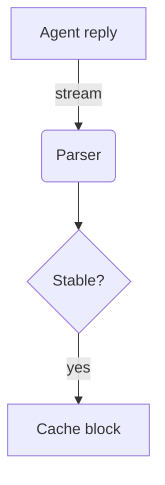

# Streaming renderer check

I read the transcript code and found **two problems** with how replies render. The first is in `AgentMarkdown.tsx`, the second in the *paced reveal*. Details below, with a fix for each and a ~~quick~~ careful test plan. See https://github.com/zed-industries/zed for prior art and [the CommonMark spec](https://spec.commonmark.org/0.31.2/).

## What changes

1. Parse incrementally from the last stable block.
2. Keep finished blocks cached, so `Arc` pointers stay equal.
   - Nested bullet with `inline code` and a [link](https://example.com).
   - Another nested bullet that is long enough to wrap onto a second line in a narrow transcript column.
3. Fade new words over 320ms.

Task list:

- [x] Parser with GFM tables and task lists
- [x] Syntax highlighting with a copy button
- [ ] Selection across the whole message

> A block quote keeps its left rule and italic text.
>
> It can hold more than one paragraph.

### Code

```rust
/// Reparse from the second-to-last top-level block.
pub fn append(&mut self, delta: &str) {
    let boundary = match self.tree.blocks.len() {
        0 | 1 => 0,
        n => self.tree.blocks[n - 2].range.start,
    };
    self.source.push_str(delta); // 42 bytes
}
```

```ts
export function revealEnd(text: string, at: number, streaming: boolean): number {
  for (let i = Math.max(0, Math.ceil(at)); i < text.length; i++) {
    if (isSpace(text.charCodeAt(i))) return i;
  }
  return streaming ? lastWordEnd(text) : text.length;
}
```

```bash
cargo test -p monocode-markdown -j 4 && echo "ok"
```

```
plain fences use the JS grammar: "strings", 123, and // comments
```



| Step | Cost | Notes |
|:-----|-----:|:------|
| Parse tail | O(tail) | `last_parse_bytes` checks it |
| Highlight | O(new lines) | syntect keeps per-line state |
| Layout | cached | GPUI reuses shaped lines |

---

#### Smaller heading

Inline styles: **bold**, *italic*, ***both***, ~~struck~~, `code`, and a [file link](src/main.rs:12).


That is the whole plan.
