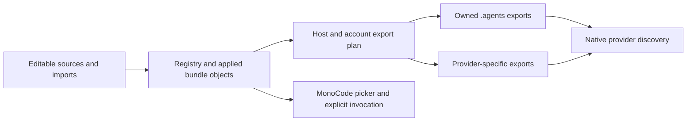

# MonoCode shared skill manager

Yes. MonoCode can provide a Skill Manager that imports a skill once and prepares it for every compatible provider. Much of the picker and settings UI already exists, but current discovery does not install or synchronize skills. **The recommended local MVP is a private managed library with owned `.agents/skills` exports and provider adapters for exceptions.** Preserve whole skill bundles, share with compatible providers by default, and retain unmanaged skills. Use directory copies first, then add links where discovery and execution tests establish support. This investigation reviewed source and upstream documentation on October 3, 2026. It did not implement the manager or prove provider behavior through live sessions.

## MonoCode lists skills but does not distribute them

The native app has eleven provider IDs and a shared scanner. It searches project `.agents/skills`, personal `.agents/skills`, then provider roots and registered Claude plugins. Earlier names win, which means a personal shared skill can shadow a project provider skill. It scans immediate children, caps results at 300 distinct names, and discards shadowed candidates. A manager needs a complete inventory before deduplication so it can explain same-name conflicts instead of hiding them. [Provider roster](/Users/gianvillarini/Documents/Github/monocode/crates/core/src/harness.rs:12), [Scanner](/Users/gianvillarini/Documents/Github/monocode/crates/process/src/skills.rs:80)

Three separate outcomes need distinct status. MonoCode picker discovery means the app can list a skill. Native availability means the active provider process can discover and select it without MonoCode explicitly injecting its body. Portability means its scripts, references, tool names, and plugin dependencies work under that provider. One outcome does not establish another.

For file skills, MonoCode currently expands a named slash invocation into the complete `SKILL.md` body. It does not advertise a catalog for automatic selection or include the original resource directory. Pi and OMP instead use provider-native command catalogs and bypass file discovery and expansion. OMP also passes leading native commands through before prompt expansion. The fix must merge catalogs and route each selected identity separately while preserving native argument bytes. Adding shared picker rows alone will not fix invocation. [Catalog and expansion](/Users/gianvillarini/Documents/Github/monocode/crates/engine/src/submit/skills/mod.rs:633), [Prompt preparation](/Users/gianvillarini/Documents/Github/monocode/crates/engine/src/submit/prompt.rs:15)

The reusable Skills page has filtering, preview, creation, rescan, and path actions. Its current native settings adapter returns `gpui::Empty`. Existing hide controls affect MonoCode's catalog, not native discovery. Connect these existing contracts to manager operations. [Settings adapter](/Users/gianvillarini/Documents/Github/monocode/apps/monocode-app/src/adapters/skills.rs:6), [Skills contract](/Users/gianvillarini/Documents/Github/monocode/crates/view-pages/src/skills/data.rs:35)

The launch audit found no explicit skill-disable flag in live Claude sessions, no `--no-skills` in live Pi or OMP sessions or their skill-command probes, and `app-server` for Codex. Pi and OMP isolated helper jobs do use `--no-skills`. Named Claude and Codex accounts change native configuration homes, but the scanner and catalog do not receive those homes or account IDs. Consequently, picker content can differ from what the selected account loads. These are source findings, not runtime proof. [Launch and account audit](../research_notes/MonoCode%20shared%20skill%20manager/current_skills.md#addendum-do-launch-flags-and-named-accounts-change-discovery)

## Eleven providers need shared exports and several adapters

The following table records upstream discovery contracts. It is a starting adapter plan, **not tested "Ready" status** for the installed binaries or MonoCode process modes. Personal roots below are documented defaults. Account overrides and runtime variants need effective-context checks.

| Provider | Documented shared discovery and proposed treatment | Important condition |
| --- | --- | --- |
| Claude Code | Personal `~/.claude/skills` and project `.claude/skills`. Export complete bundles there. | `.agents/skills` is not a documented native root. Per-skill symlinks are documented. [Claude](https://code.claude.com/docs/en/skills) |
| Codex | Personal `~/.agents/skills` and project `.agents/skills` through repository ancestors. Use the shared export. | Symlinked skill folders are documented. Profile configuration and exclusions still need account-aware handling. [Codex](https://learn.chatgpt.com/docs/build-skills) |
| Cursor | Personal and project `.agents/skills`, plus Cursor and compatibility roots. Use the shared export. | Local installation does not automatically reach Cloud Agents, remote SSH sessions, or workers. Symlinks unresolved. [Cursor](https://cursor.com/docs/skills) |
| Grok Build | Personal `~/.agents/skills`, `~/.grok/skills`, and configurable paths. Use the personal shared export. | Project `.agents/skills` was not expressly documented on the inspected page. Use a project adapter where required. [Grok](https://docs.x.ai/build/features/skills-plugins-marketplaces) |
| OpenCode | Personal `.agents/skills`, Claude roots, and `~/.config/opencode/skills`. Project `.agents/skills` through worktree ancestors. | Use the shared export. Unknown frontmatter can be ignored rather than implemented. Symlinks unresolved. [OpenCode](https://opencode.ai/docs/skills/) |
| Pi | Personal `.agents/skills`, project ancestor discovery, native roots, and configurable skill paths. | Use the shared export. Discovery is recursive and loader source follows directory symlinks. [Pi](https://github.com/earendil-works/pi/blob/main/packages/coding-agent/docs/skills.md), [Loader](https://github.com/earendil-works/pi/blob/main/packages/coding-agent/src/core/skills.ts) |
| OMP | Native `~/.omp/agent/skills`, foreign roots, and custom directories. | Foreign personal providers need `enabledProviders`. Prefer an owned native export until configuring that integration. Conventional roots scan one level. [OMP](https://github.com/can1357/oh-my-pi/blob/main/docs/skills.md) |
| fx | Personal and project `.agents/skills` plus native and compatibility roots. | Use the shared export. Additional workspace directories do not supply skills. Symlinks unresolved. [fx](https://fx.sh/docs/capabilities/skills) |
| Hermes Agent | Personal profile-local `.hermes/skills`. Shared personal roots require `skills.external_dirs`. | Configure the shared root or use an owned native export. Project `.agents/skills` requires trust. Symlinks unresolved. [Hermes](https://hermes-agent.nousresearch.com/docs/user-guide/features/skills/) |
| Factory Droid | Personal and project `.agents/skills`, `.agent/skills`, and `.factory/skills`. | Use the shared export. Recursive discovery stops at a skill directory. Symlinks unresolved. [Droid](https://docs.factory.com/harness/skills) |
| Antigravity | Project `.agents/skills`. Global IDE and 2.0 root is `.gemini/config/skills`; CLI root is `.gemini/antigravity-cli/skills`. | Verify which root MonoCode's ACP process uses before choosing the personal export. Symlinks unresolved. [Antigravity](https://antigravity.google/docs/skills) |

Keep exports flat as `<root>/<name>/SKILL.md` and preserve sibling directories. Recursive loaders do not make nested collections portable to one-level loaders. The Agent Skills specification defines instructions and supporting files, not dependency provisioning. Claude execution extensions, Codex sidecars, and plugin tools can require provider-specific treatment. Copying a plugin skill does not install its MCP connections, hooks, tools, or authentication. Preserve unknown metadata and report compatibility requirements. [Agent Skills specification](https://agentskills.io/specification), [Claude extensions](https://code.claude.com/docs/en/skills), [Codex metadata](https://learn.chatgpt.com/docs/build-skills)

Independent provider enable switches should wait. A provider can discover the same skill through `.agents` and compatible roots even after its own export disappears. Some providers have native exclusions, while others lack an established per-skill exclusion contract. "Hide from MonoCode picker" and "Stop sharing managed copies" are enforceable initial actions. Neither promises to erase native unmanaged copies or instructions already loaded in a conversation. [Exclusion comparison](../research_notes/MonoCode%20shared%20skill%20manager/provider_compatibility.md#how-can-a-provider-disable-a-shared-skill)

## Import once, preserve ownership, and apply complete bundles

The proposed Rust service should store editable sources, immutable applied bundle objects, a registry, and an export ownership manifest beneath MonoCode's existing data directory. Record a stable skill ID separately from public name, source location, upstream revision, and content digest. Hash relative paths, bytes, and executable modes. Export once to `.agents/skills` for verified readers, then create extra copies only for exceptions. Copies avoid making Windows link privileges a requirement. Links can become an optimization after platform and provider tests. [Existing data directory](/Users/gianvillarini/Documents/Github/monocode/apps/monocode-app/src/data_dir.rs:1)

Local-folder import and adoption of existing skills should come first. Import the entire directory, validate frontmatter with a YAML parser, preserve body bytes and unknown fields, and retain resource paths. Do not silently copy external symlink targets or assume absolute machine paths will work elsewhere. Same-name and same-digest copies share content but retain their locations and provenance. Same-name and different-digest bundles are conflicts with explicit source or alias selection. Native commands remain separate identities even when their names match.

"Edit" should open an editable source directory, either an adopted project source or a managed working copy. "Apply" validates that source, snapshots a new bundle revision, previews export changes, and reconciles unchanged owned destinations. Imported upstream content retains its provenance; local edits create a local revision. Never open immutable objects for ordinary editing. If someone edits an exported copy outside MonoCode, preserve the edit and report a conflict. Offer to adopt it or restore the managed revision after review.

Reconciliation should stage complete directories, verify ownership under a manager lock, and record recoverable steps before replacing exports. The ownership manifest records destination, applied digest or exact link target, provider context, and completed generation. Only remove or replace destinations that still match their owned state. Preserve unmanaged directories. A multi-root apply is recoverable and idempotent, not a single filesystem transaction. A failed apply reports partial status and retains a valid prior bundle.

Run reconciliation after imports, applies, provider installation, account creation, and before relevant child launches. Resolve the selected account and effective configuration homes first. Include host, account, resolved homes, working directory, and library generation in catalog keys. Explicit invocation should carry the host-local `SKILL.md` path and resource base directory without changing the project's working directory. Pi and OMP need selected-identity routing so shared skills expand while genuine native commands pass through unchanged. [Account resolution](/Users/gianvillarini/Documents/Github/monocode/crates/process/src/harness.rs:924), [Current cache context](/Users/gianvillarini/Documents/Github/monocode/crates/engine/src/submit/skills/mod.rs:140)

Show "Exported, not runtime verified", "Pending refresh", "Conflict", "Manual invocation only", and "Missing dependency" where appropriate. Reserve "Ready" for the specific provider, account, host, and version after a successful discovery or invocation check. Changes should normally apply to new sessions. Record observed revisions for diagnosis, but do not promise immutable session pinning when a native process can reread mutable exports or scan other roots.

## Ship the local manager before remote synchronization

First connect the existing Skills page to real data, expose duplicates, and correct Pi and OMP's mixed invocation path. Then implement local import, editable source and apply, owned exports, launch reconciliation, and native discovery checks. That second stage is the first usable MVP that meets "install once and share". Automatic upstream updates, rollback UI, plugin integration, and precise native exclusions can follow without blocking local sharing.

| Integration point | Required change |
| --- | --- |
| New `crates/skills` service | Registry, bundle validation, digests, editable sources, ownership, reconcile plans, and recovery. Keep it independent of GPUI. |
| `crates/process/src/skills.rs` | Add complete inventory before deduplication and effective-root context. |
| Harness provider capabilities and child launch | Describe discovery and refresh contracts. Prepare exports with resolved account homes and launch purpose. |
| Engine skill catalog and prompt preparation | Merge native and file entries, preserve identity, carry resource paths, and key caches by full context. |
| App boot and composer host | Retain the service, invalidate affected catalogs, and pass selected identity and account context. |
| Skills settings adapter and page | Connect real IO and add import, edit/apply, duplicate details, compatibility, and status. |
| Host skills and session dispatch, later | Run preparation and resource resolution on the execution host. |
| Remote protocol and client, later | Negotiate capability and transfer missing bundles by digest, then obtain host-confirmed status. |

Acceptance must prove behavior beyond picker rows. Import a bundle with a referenced file and executable script, then launch each supported provider without manual copying and verify native discovery and resource use. Test shared skills beside genuine Pi and OMP commands, including unchanged native arguments and same-name collisions. Verify equal-content deduplication, divergent-content conflicts, unmanaged preservation, and external edits that block replacement. Interrupt apply at different recovery steps, restart, and confirm complete valid bundles. A repeated unchanged reconciliation should perform no writes.

Test default and named Claude and Codex accounts, inherited `CODEX_HOME` and `CLAUDE_CONFIG_DIR`, paths with spaces, and Windows without link privileges. Confirm that picker and native runtime use the intended account context. Test provider refresh separately from successful export. Keep a live turn running during an apply and report its refresh requirement without forcing it to stop.

Remote sharing should be a later host-owned operation. Current host code lists host-local skills, but the remote composer excludes file skills and the host dispatch bypasses desktop prompt preparation. Named remote accounts are currently rejected. Add inventory, missing-content, upload, apply, and status methods with capability negotiation. Transfer only missing bundle content, let the host compute its own export plan, and preserve host-local unmanaged skills. Desktop paths must never become remote resource bases. Test interrupted transfer, reconnect, offline status, and multiple source-library ownership before claiming remote synchronization. [Host listing](/Users/gianvillarini/Documents/Github/monocode/crates/host/src/workspace_commands.rs:655), [Remote composer](/Users/gianvillarini/Documents/Github/monocode/crates/view-composer/src/composer/view/mod.rs:526), [Host account limitation](/Users/gianvillarini/Documents/Github/monocode/crates/host/src/child_backend.rs:129)

## Reuse import tooling without outsourcing synchronization

Canonical `.agents/skills` plus a registry and exception exports is the cheaper alternative. It still needs conflict inventory, ownership, account context, and runtime checks, but avoids a private content store. Choose it if the first release only needs shared local availability and editable files. The recommended private store adds explicit applied revisions and recovery, which fit later remote reuse and safe updates. Neither design independently guarantees per-provider isolation.

Vercel's `skills` CLI already imports sources and installs for ten of MonoCode's eleven providers, with no OMP target in the inspected snapshot. It requires Node `>=22.20.0` and has no documented public SDK entry. Its installer can remove an existing destination before copying, and its update flow does not establish MonoCode ownership or preserve local edits. Therefore, use a pinned CLI only as an optional staging importer. Rust should remain the synchronization authority. The documented skills.sh API offers catalog data but has unresolved general desktop authentication in this review. [CLI package](https://github.com/vercel-labs/skills/blob/18f96ea131dab3b0fcc9b27cf7c6f6cbb6174680/package.json), [Installer](https://github.com/vercel-labs/skills/blob/18f96ea131dab3b0fcc9b27cf7c6f6cbb6174680/src/installer.ts), [API](https://skills.sh/docs/api)

Explicit prompt injection remains a fallback for providers without native discovery. It must preserve resource context and report manual-only behavior. Automatic catalog advertisement would be separate work and should not count as verified native loading.

This recommendation rests on source and documentation review. No provider was launched and no personal skill collection was classified. No application source or provider configuration changed. The focused scanner test attempt waited on an occupied shared build lock and stopped before any tests ran. Runtime versions, exception adapters, reload behavior, tool dependencies, and most symlink combinations remain unverified. The next engineering milestone should be the local import-and-apply path with representative native checks, then expansion to additional verified providers.

The supporting notes contain the [current-code audit](../research_notes/MonoCode%20shared%20skill%20manager/current_skills.md), [provider contracts](../research_notes/MonoCode%20shared%20skill%20manager/provider_compatibility.md), [design details](../research_notes/MonoCode%20shared%20skill%20manager/manager_design.md), and [tool comparison](../research_notes/MonoCode%20shared%20skill%20manager/existing_tools.md).
